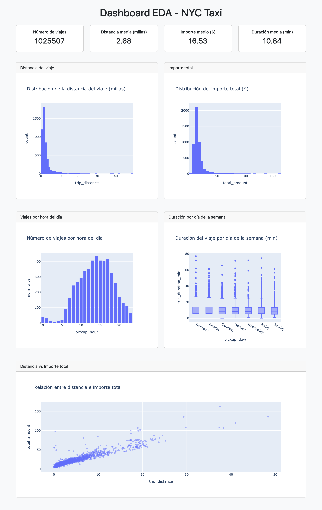
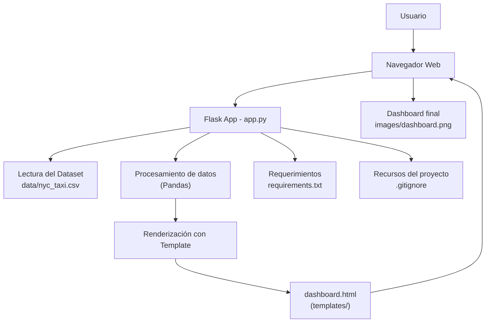

## NYC Taxi EDA Dashboard:
Flask + Bootstrap | Exploratory Data Analysis | Gráficos interactivos

Este proyecto implementa un dashboard web para explorar datos del NYC Taxi Dataset.
Está construido con Python, Flask y Bootstrap, e incluye visualizaciones procesadas previamente en Python.

## 🖼 Vista del Dashboard

#Características principales:

-Dashboard web con interfaz limpia y responsive
-Análisis exploratorio del dataset NYC Taxi
-Gráficos sobre:
   Número de viajes
   Distancia media
   Importe total
   Duración promedio
   Distribución por hora y día de la semana
-Backend en Flask
-Frontend usando Bootstrap 5

🗂 Estructura del proyecto:

nyc_taxi_eda_dashboard/
│
├── data/
│   └── nyc_taxi.csv            # Dataset de ejemplo
│
├── templates/
│   └── dashboard.html          # Plantilla principal del dashboard
│
├── app.py                       # Aplicación Flask
├── requirements.txt             # Dependencias del proyecto
└── .gitignore                   # Archivos ignorados por Git

## 🧠 Arquitectura del proyecto 

▶️ Cómo ejecutar el proyecto:

1) Clonar el repositorio:
   
git clone https://github.com/CarlosRivasplata/nyc_taxi_eda_dashboard.git
cd nyc_taxi_eda_dashboard

2) Crear entorno virtual:

python3 -m venv venv
source venv/bin/activate

3) Instalar dependencias:

pip install -r requirements.txt

4) Ejecutar la aplicación:

python app.py

📌 Pendientes / Mejoras futuras:

-Añadir gráficos interactivos con Plotly o Chart.js
-Conectar con una base de datos
-Agregar tests automáticos
-Implementar un pipeline ETL básico

📄 Licencia:

MIT — siéntete libre de usarlo y modificarlo.

